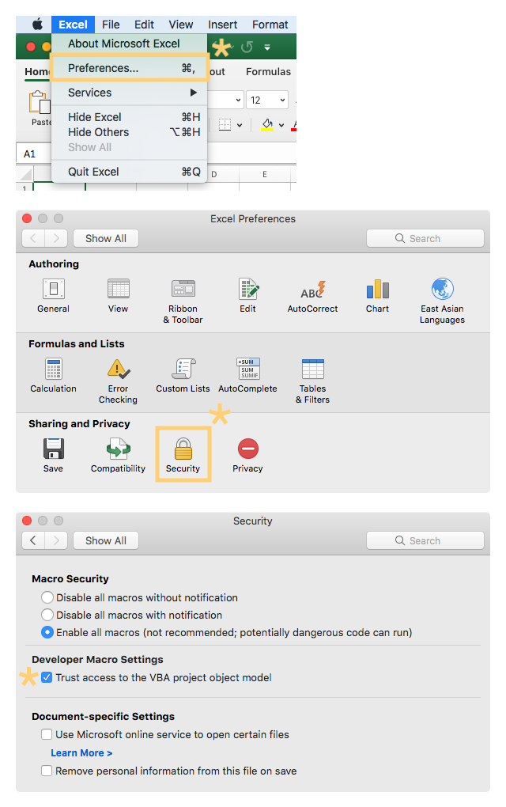

# vba-blocks CLI Installer

__Windows__

In powershell, run the following:

```shellsession
> iwr https://vba-blocks.com/install.ps1 | iex
```

__Mac__

In terminal, run the following:

```shellsession
$ curl -fsSL https://vba-blocks.com/install.sh | sh
```

For more recent versions of Office for Mac, you will need to trust access to the VBA project object model for vba-blocks to work correctly:

<details>
  <summary>Trust access to the VBA project object model</summary>
  <ol>
    <li>Open Excel</li>
    <li>Click "Excel" in the menu bar</li>
    <li>Select "Preferences" in the menu</li>
    <li>Click "Security" in the Preferences dialog</li>
    <li>Check "Trust access to the VBA project object model" in the Security dialog</li>
    
 </ol>
</details>
